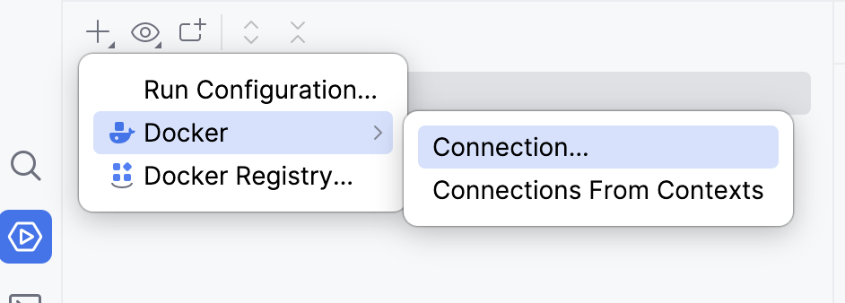
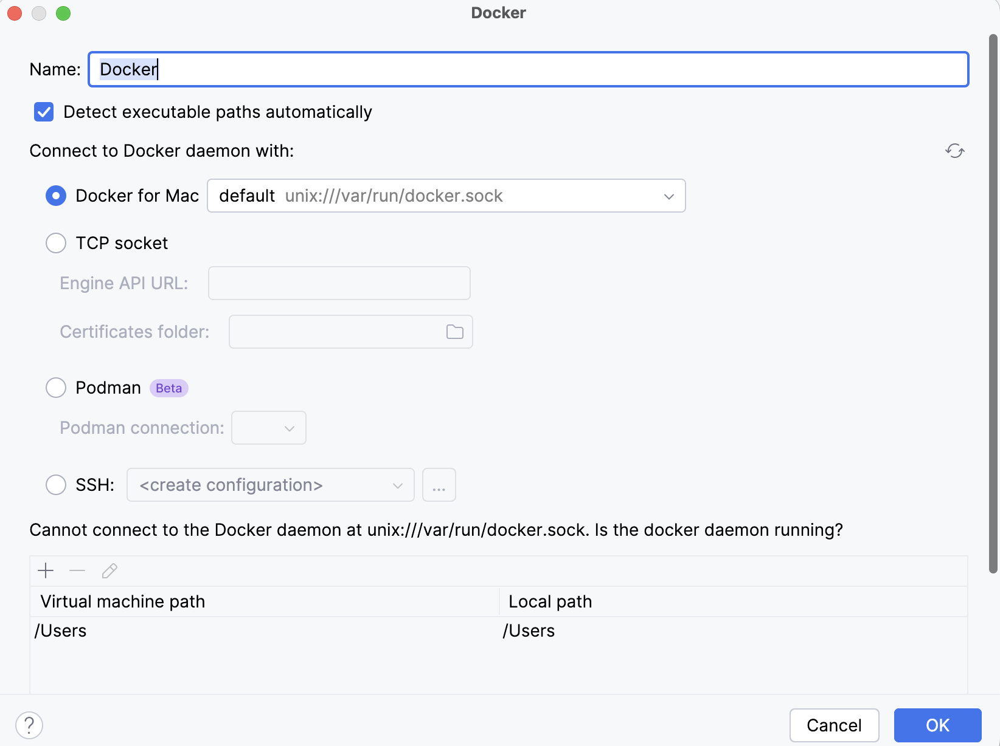

# Instrucciones para realizar el examen
A continuación, se detallan los pasos para poder configurar PHP Storm y Docker para el funcionamiento del proyecto.

## Conexión de PHPStorm al servicio Docker
En el apartado de servicios tenemos que configurar una conexión al servicio de docker



## Ejecutamos docker-compose.yml
Para que se cree la imagen necesaria, además de los contenedores tenemos que pulsar en el botón derecho sobre `docker-compose.yml` y seleccionamos la opción RUN

Tras unos minutos se habrá generado la imagen necesaria y se habrá instalado todos los contenedores.

## Ejecutamos composer update para instalar las librerías 
Con los contenedores creados tenemos que entrar en la terminal del contenedor de PHP para poder instalar las librerías necesarias para trabajar en el proyecto.

```shell
composer update
```

## Creamos una conexión a la base de datos
Pulsamos en el icono de la base de datos que está en la barra derecha de la interfaz.

Creamos un nuevo Data Source y lo configuramos con los siguientes datos
```
Host: localhost
Port: 3310
User: alumno
Password: alumno
Database: examen
```

## Ejecutamos el fichero sql contra la base de datos.
En la carpeta `sql` tenemos un script para poder ejecutar contra el Data Source que hemos creado y crear la base de datos.